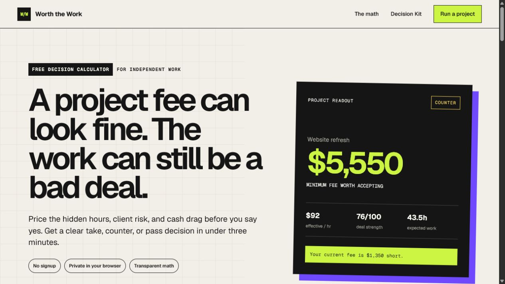

# Worth the Work

Free, open-source calculators for pricing freelance projects, protecting scope,
estimating revisions and rush work, and handling overdue invoices without
guesswork.

[](https://rookepoole.github.io/worth-the-work/)

Everything runs in the browser without an account. Project details remain on
the device, and every calculation exposes its assumptions so a freelancer can
check the arithmetic before using the result.

## Choose the right freelance calculator

| Free tool | Question it answers | Result |
| --- | --- | --- |
| [Freelance project decision calculator](https://rookepoole.github.io/worth-the-work/) | Is this quoted project financially worth accepting? | Minimum fee, effective hourly rate, deposit, risk buffer, and `TAKE` / `GUARDRAIL` / `COUNTER` / `PASS` recommendation |
| [Freelance project cost calculator](https://rookepoole.github.io/worth-the-work/freelance-project-cost-calculator/) | What should the full project quote be? | Quote floor and deposit from workload, direct costs, contingency, and target margin |
| [Scope-creep clause generator](https://rookepoole.github.io/worth-the-work/scope-creep-clause-generator/) | How should included work and change requests be defined? | Copy-ready scope and change-control language |
| [Freelance revision cost calculator](https://rookepoole.github.io/worth-the-work/freelance-revision-cost-calculator/) | What do extra revision rounds really cost? | Included-versus-extra revision hours, cost, and overage language |
| [Freelance quote response generator](https://rookepoole.github.io/worth-the-work/freelance-quote-response-generator/) | How should a freelancer respond to a client quote? | Editable accept, counteroffer, clarify, or decline response |
| [Freelance rush-fee calculator](https://rookepoole.github.io/worth-the-work/freelance-rush-fee-calculator/) | What premium covers compressed delivery and disruption? | Rush premium, accelerated quote, and client explanation |
| [Freelance late-payment fee calculator](https://rookepoole.github.io/worth-the-work/freelance-late-payment-calculator/) | What do the written terms add to an overdue invoice? | Simple interest, grace-period and flat-fee treatment, updated balance, delayed-cash cost, and factual reminder |

All seven tools support USD, EUR, GBP, CAD, AUD, and NZD without pretending to
perform currency conversion.

## How the main project decision calculator works

The main calculator combines delivery hours, meetings, administration,
revisions, direct costs, tax reserve, payment delay, scope risk, and desired
profit. It then shows the fee needed to protect the freelancer's target hourly
return and flags the quote as:

- `TAKE` when the economics clear the stated target;
- `GUARDRAIL` when the fee can work with stronger scope or payment terms;
- `COUNTER` when the quote should be raised; or
- `PASS` when the gap is too large to repair sensibly.

The result is planning support, not legal, tax, accounting, or financial advice.
Any contractual fee or clause still depends on the written agreement and
applicable law.

## Privacy and licensing

- Calculations and generated text run locally in the browser.
- There are no analytics scripts, advertising scripts, cookies, accounts, or
  server-side input storage.
- Outbound product links contain ordinary UTM parameters. No calculator input
  is ever included in those links.
- The source is available under the [MIT License](LICENSE).

## Optional templates and client scripts

The calculators are free and complete. Freelancers who want editable working
files can also use the separate resources below:

- [Free freelance project red-flag checklist](https://prairiegrantscout.gumroad.com/l/freelance-project-red-flag-checklist?utm_source=github&utm_medium=repository&utm_campaign=worth_the_work&utm_content=readme_free)
- [Worth the Work decision workbook and 24-script client library](https://prairiegrantscout.gumroad.com/l/worth-the-work?utm_source=github&utm_medium=repository&utm_campaign=worth_the_work&utm_content=readme_paid)

## Local development

Requires Node.js 22.13 or later.

```bash
npm ci
npm run dev
```

Run `npm test` to produce and verify the GitHub Pages static export.
